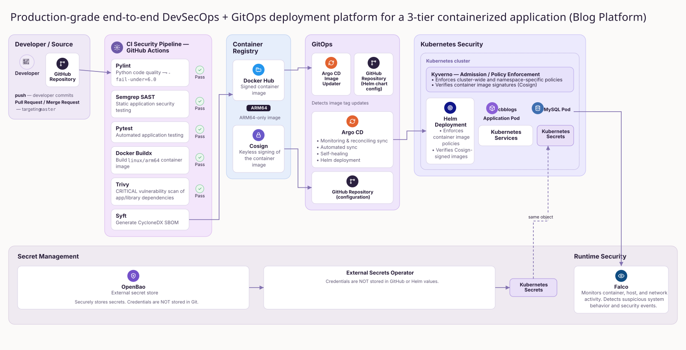

# 🚀 CBBlogs — DevSecOps & GitOps Platform

> Secure the code. Secure the supply chain. Secure the deployment. Secure the runtime.

CBBlogs is a **Python Flask-based blogging platform** deployed through an end-to-end **DevSecOps and GitOps pipeline**.

The project demonstrates how security can be integrated throughout the complete software delivery lifecycle — from source-code analysis and automated testing to container security, image signing, GitOps deployment, Kubernetes policy enforcement, centralized secret management, and runtime security.

---

## 📸 Project Overview



> 🔐 End-to-end DevSecOps and GitOps pipeline for CBBlogs, covering CI security, container security, image signing, GitOps deployment, Kubernetes policy enforcement, secret management, and runtime security.

---

# 🏗️ Architecture

```text
                         Developer
                             │
                             ▼
                    ┌─────────────────┐
                    │     GitHub      │
                    │  Pull Request   │
                    └────────┬────────┘
                             │
                             ▼
                  ┌─────────────────────┐
                  │    GitHub Actions   │
                  │                     │
                  │  Pylint             │
                  │  Semgrep SAST      │
                  │  Pytest             │
                  └─────────┬───────────┘
                            │
                            ▼
                  ┌─────────────────────┐
                  │   Docker Build      │
                  │      ARM64          │
                  └─────────┬───────────┘
                            │
                    ┌───────┴────────┐
                    ▼                ▼
              ┌──────────┐     ┌──────────┐
              │  Trivy   │     │   Syft   │
              │  Scan    │     │   SBOM   │
              └────┬─────┘     └────┬─────┘
                   │                │
                   └───────┬────────┘
                           ▼
                    ┌──────────────┐
                    │   Cosign     │
                    │ Image Signing │
                    └──────┬───────┘
                           │
                           ▼
                    ┌──────────────┐
                    │  Docker Hub  │
                    └──────┬───────┘
                           │
                           ▼
                 ┌─────────────────────┐
                 │ Argo CD Image Updater│
                 └──────────┬──────────┘
                            │
                            ▼
                       ┌─────────┐
                       │ Argo CD │
                       └────┬────┘
                            │
                            ▼
                     ┌──────────────┐
                     │    Helm      │
                     │    Chart     │
                     └──────┬───────┘
                            │
                            ▼
                     ┌──────────────┐
                     │   Kyverno    │
                     │  Admission   │
                     │   Policies   │
                     └──────┬───────┘
                            │
                            ▼
                    ┌─────────────────┐
                    │   Kubernetes    │
                    │                 │
                    │    CBBlogs      │
                    │    MySQL        │
                    └───────┬─────────┘
                            │
                  ┌─────────┴─────────┐
                  ▼                   ▼
             ┌─────────┐       ┌──────────────┐
             │  Falco  │       │   OpenBao    │
             │ Runtime │       │    Secrets   │
             │ Security│       └──────┬───────┘
             └─────────┘              │
                                      ▼
                              External Secrets
```

---

# 🔐 DevSecOps Pipeline

The project implements security controls at multiple stages of the software lifecycle.

## 1. Code Quality

**Pylint** is used to analyze the Python source code and enforce a minimum code-quality threshold.

```text
Source Code
     ↓
   Pylint
     ↓
Quality Gate
```

---

## 2. Static Application Security Testing

**Semgrep** performs SAST against the application source code.

It helps identify potentially insecure coding patterns before the application is packaged and deployed.

```text
Python Source
     ↓
   Semgrep
     ↓
Security Analysis
```

---

## 3. Automated Testing

**Pytest** runs the application's automated test suite.

The container build is allowed to continue only after the previous CI stages complete successfully.

---

## 4. ARM64 Container Build

The application is packaged into a Docker image targeting:

```text
linux/arm64
```

The ARM64 image is intended to run on ARM-based Kubernetes infrastructure.

---

## 5. Container Vulnerability Scanning

**Trivy** scans the container image before it is pushed to the registry.

The current CI security gate focuses on:

- CRITICAL vulnerabilities
- Application/library dependencies
- Unfixed vulnerabilities are ignored

A failed security gate prevents the image from being promoted.

---

## 6. Software Bill of Materials

**Syft** generates an SBOM for the container image.

The SBOM provides an inventory of software components and dependencies contained within the image.

Output:

```text
sbom.json
```

This provides additional visibility into the application's software supply chain.

---

## 7. Container Image Signing

**Cosign** is used to sign the container image after it passes the security checks.

```text
Docker Image
     ↓
   Cosign
     ↓
Signed Image
```

Image signing provides a way for the deployment environment to verify the provenance and integrity of container images.

---

# 🚢 GitOps Deployment

## Argo CD

**Argo CD** is used for continuous delivery using the GitOps model.

The desired Kubernetes state is maintained in Git.

Argo CD continuously compares:

```text
Git Desired State
        │
        ▼
     Argo CD
        │
        ▼
Kubernetes Actual State
```

When the desired state changes, Argo CD synchronizes the Kubernetes environment.

---

## Argo CD Image Updater

Argo CD Image Updater monitors the configured container image repository for new application versions.

The project uses Git commit SHA-based image tags.

Example:

```text
c988277f34057e25fbe78ba9d1bbd677628274cf
```

The Image Updater is configured to consider valid application image tags and update the deployment configuration when a new image is available.

---

# 📦 Helm

The Kubernetes deployment is packaged as a Helm chart.

The Helm chart contains the Kubernetes resources required to deploy CBBlogs.

Example:

```text
cbblogs/
├── Chart.yaml
├── values.yaml
└── templates/
    ├── deployment.yaml
    ├── service.yaml
    └── ...
```

Helm allows the application configuration and Kubernetes resources to be version-controlled and deployed consistently.

---

# 🛡️ Kubernetes Security

## Kyverno

**Kyverno** provides Kubernetes admission policy enforcement.

It can be used to enforce security requirements before workloads are admitted into the cluster.

Examples of policies include:

- Container image policies
- Image signature verification
- Allowed registries
- Security-related workload configuration
- Kubernetes resource validation

This creates an additional security layer between the deployment system and the Kubernetes runtime.

---

# 🔑 Secret Management

## OpenBao

Sensitive configuration is managed using **OpenBao** rather than storing credentials directly inside Git.

Secrets such as database credentials are maintained outside the application source code and Helm configuration.

```text
OpenBao
   │
   ▼
External Secrets
   │
   ▼
Kubernetes Secret
   │
   ├── CBBlogs
   └── MySQL
```

This keeps sensitive credentials separate from application and infrastructure code.

---

## External Secrets

**External Secrets** retrieves secrets from OpenBao and synchronizes them into Kubernetes Secrets.

This allows applications to consume secrets through Kubernetes without storing the actual secret values in Git.

---

# 🛡️ Runtime Security

## Falco

**Falco** provides runtime security monitoring for the Kubernetes environment.

While CI security and admission policies protect the application before deployment, Falco monitors activity after the workload is running.

It can detect suspicious or unexpected runtime behavior based on configured security rules.

```text
CI Security
     ↓
Container Security
     ↓
Admission Security
     ↓
Runtime Security
```

---

# 🔄 Complete Workflow

The complete software delivery process is:

```text
Developer
    ↓
GitHub Pull Request
    ↓
Pylint
    ↓
Semgrep SAST
    ↓
Pytest
    ↓
Docker ARM64 Build
    ↓
Trivy Vulnerability Scan
    ↓
Syft SBOM
    ↓
Cosign Image Signing
    ↓
Docker Hub
    ↓
Argo CD Image Updater
    ↓
Argo CD
    ↓
Helm
    ↓
Kyverno Policies
    ↓
Kubernetes
    ↓
CBBlogs + MySQL
    ↓
Falco Runtime Security
```

---

# 🔥 Application Features

Although the primary focus of this project is the DevSecOps platform, CBBlogs itself provides a lightweight blogging and CMS experience.

## ⚙️ Admin CMS

- Create blog posts
- Edit posts
- Delete posts
- Manage published content

## 📝 Blogging

- Dynamic post rendering
- Markdown support
- Structured blog interface

## 👤 User System

- User registration
- User login
- Subscription functionality

## 💬 Engagement

- Comments
- Likes
- User interaction

## ⭐ Favorites

- Save posts
- Access saved content

## 🔍 Search

- Search blog posts
- Discover content quickly

---

# 🧱 Technology Stack

| Category | Technology |
|---|---|
| Application | Python |
| Backend | Flask |
| Database | MySQL |
| Templates | Jinja2 |
| Frontend | HTML / CSS |
| Source Control | GitHub |
| CI/CD | GitHub Actions |
| Code Quality | Pylint |
| SAST | Semgrep |
| Testing | Pytest |
| Containerization | Docker |
| Container Architecture | ARM64 |
| Vulnerability Scanner | Trivy |
| SBOM | Syft |
| Image Signing | Cosign |
| Container Registry | Docker Hub |
| GitOps | Argo CD |
| Image Automation | Argo CD Image Updater |
| Kubernetes Packaging | Helm |
| Policy Enforcement | Kyverno |
| Secret Management | OpenBao |
| Secret Synchronization | External Secrets |
| Runtime Security | Falco |
| Orchestration | Kubernetes |

---

# 📁 Project Structure

```text
cbblogs/
│
├── .github/
│   └── workflows/
│       ├── linting.yml
│       ├── sast.yml
│       ├── run_tests.yml
│       └── docker-image.yml
│
├── cbblogs/
│   ├── Chart.yaml
│   ├── values.yaml
│   └── templates/
│       ├── deployment.yaml
│       ├── service.yaml
│       └── ...
│
├── tests/
│   └── test_app.py
│
├── app.py
├── Dockerfile
├── requirements.txt
├── requirements-dev.txt
├── sbom.json
└── README.md
```

---

# 🚀 Deploy Locally with Helm

The application can be deployed using the included Helm chart.

```bash
helm install cbblogs ./cbblogs
```

For local development where a database password is required:

```bash
helm install cbblogs ./cbblogs --set mysql.password=$dbpass
```

> ⚠️ Avoid committing passwords or other sensitive values into Git. For production deployments, secrets should be supplied through the project's secret-management workflow using OpenBao and External Secrets.

Check the deployment:

```bash
kubectl get pods
kubectl get svc
```

---

# 🔒 Security Model

The project implements security across multiple layers:

| Layer | Security Control |
|---|---|
| Source Code | Pylint |
| Application Security | Semgrep |
| Application Testing | Pytest |
| Container | Trivy |
| Software Supply Chain | Syft SBOM |
| Image Integrity | Cosign |
| Deployment | Argo CD |
| Kubernetes Packaging | Helm |
| Admission Control | Kyverno |
| Secrets | OpenBao |
| Secret Synchronization | External Secrets |
| Runtime | Falco |

The objective is to avoid relying on a single security mechanism and instead establish multiple security controls throughout the delivery lifecycle.

---

# 🎯 Project Objectives

This project demonstrates:

- 🔐 Shift-left security
- 🧪 Automated application testing
- 🐳 Secure container builds
- 🔎 Container vulnerability scanning
- 📦 Software Bill of Materials generation
- ✍️ Container image signing
- 🚢 GitOps-based deployments
- ☸️ Kubernetes policy enforcement
- 🔑 Centralized secret management
- 🛡️ Runtime security monitoring
- 🏗️ ARM64 container deployment

---

# 📜 License

This project is open-source and available under the **MIT License**.

---

# 👨‍💻 Author

**CBcodes03**

🔗 https://github.com/CBcodes03

---

# ⭐ Support

If you find this project useful:

- ⭐ Star the repository
- 🍴 Fork the project
- 🚀 Build your own DevSecOps pipeline
- 💡 Use the architecture as a reference for your own projects

---

> 💡 **CBBlogs is not just a blogging application — it is a demonstration of how an application can be built, secured, signed, deployed, and monitored across the complete software delivery lifecycle.**